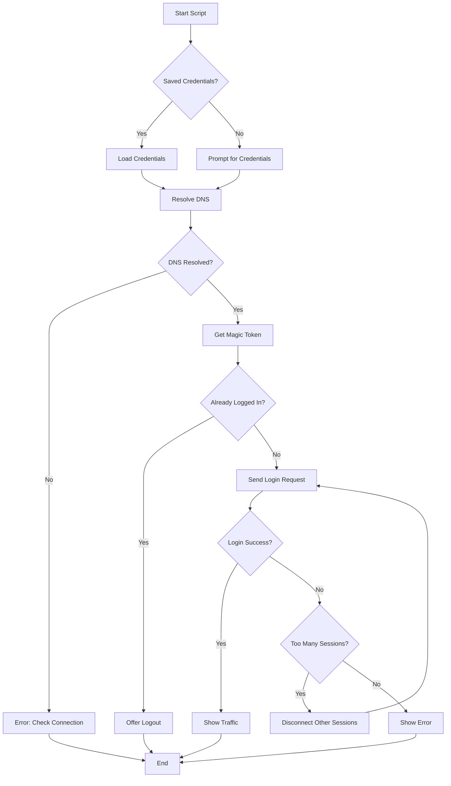

# 🌐 UT Internet Login Script

[](https://github.com/PowerShell/PowerShell)
[](LICENSE)
[](https://github.com)
[](https://github.com/MPCodeWriter21/UT-Internet/releases/latest)
[](https://github.com/MPCodeWriter21/UT-Internet/releases)

A powerful and user-friendly PowerShell script for managing University of Tehran (UT)
network authentication. This script simplifies the login process with features like
credential management, session control, and traffic monitoring.

---

## ✨ Features

- 🔐 **Secure Credential Management**: Save your credentials securely for future use
- 🔄 **Smart Session Detection**: Automatically detects if you're already logged in
- 👥 **Multi-Account Support**: Add and manage multiple UT accounts
- 🚪 **Session Management**: Log out from active sessions with ease
- 📊 **Traffic Monitoring**: View your remaining internet traffic quota
- 🔌 **Multi-Session Handling**: Disconnect other active sessions when needed
- 🎨 **Colorful Interface**: Beautiful, color-coded output for better readability
- ⚙️ **Flexible Options**: Multiple command-line flags for customized behavior

---

## 📋 Table of Contents

- [Requirements](#requirements)
- [Installation](#installation)
- [Usage](#usage)
  - [Basic Usage](#basic-usage)
  - [Command-Line Options](#command-line-options)
- [Features in Detail](#features-in-detail)
- [How It Works](#how-it-works)
- [Troubleshooting](#troubleshooting)
- [Security](#security)
- [Contributing](#contributing)
- [License](#license)
- [Author](#author)

---

## Requirements

- **Operating System**: Windows
- **PowerShell**: Version 5.1 or higher
- **Network**: Connected to the University of Tehran network
- **Permissions**: Ability to make HTTPS requests

To check your PowerShell version:

```powershell
$PSVersionTable.PSVersion
```

---

## Installation

### Method 1: Download from Releases (Recommended)

Download the latest version from the [Releases page](https://github.com/MPCodeWriter21/UT-Internet/releases/latest):

1. Download `login-to-internet.cmd`
2. Double-click to run
3. Perfect for users unfamiliar with PowerShell

### Method 2: Clone Repository

```powershell
# Clone the repository
git clone https://github.com/yourusername/UT-Internet.git

# Navigate to the directory
cd UT-Internet

# Run the script
.\login-to-internet.ps1
```

---

## Usage

### Basic Usage

Simply run the script in PowerShell:

```powershell
.\login-to-internet.ps1
```

On first run, you'll be prompted to enter your username and password. By default,
credentials are saved securely for future use.

### Command-Line Options

| Flag                  | Description                                                  |
| --------------------- | ------------------------------------------------------------ |
| `-reset`              | Reset saved credentials and prompt for new ones              |
| `-noSave`             | Don't save credentials (prompt every time)                   |
| `-addAccount`         | Add a new account to saved credentials                       |
| `-chooseDefault`      | Set the default account from saved accounts                  |
| `-chooseAccount`      | Select an account for this session (keeps default unchanged) |
| `-noRemainingTraffic` | Skip displaying remaining traffic quota                      |
| `-help`               | Display help message with usage information                  |
| `-version`            | Display script version                                       |

---

## Features in Detail

### 1. **Secure Credential Storage**

Your credentials are encrypted using PowerShell's built-in `ConvertFrom-SecureString`
cmdlet and stored in a hidden system file. The credentials are encrypted with your
Windows user account, making them inaccessible to other users.

**Security measures:**

- Credentials encrypted with user-specific key
- Hidden system file

### 2. **Automatic Session Detection**

The script intelligently detects if you're already logged in to the UT network by
parsing the portal response. If you're logged in, it offers to:

- Show your current session status
- Display remaining traffic
- Log you out if desired

### 3. **Multi-Session Management**

If login fails due to too many active sessions, the script can:

- Detect the conflict automatically
- Offer to disconnect other sessions
- Retry login after disconnecting

### 4. **Traffic Monitoring**

View your remaining internet quota in human-readable format:

- Automatically converts UNITS to MB/GB/TB
- Color-coded output for easy reading

### 5. **Smart DNS Resolution**

The script uses multiple DNS servers to resolve the login portal:

- Primary DNS: `192.168.20.14`
- Secondary DNS: `192.168.20.15`
- Fallback: System default DNS

This ensures reliable connection even if one DNS server is down.

---

## How It Works

### Login Process Flow



---

## Troubleshooting

### Common Issues and Solutions

#### ❌ "Failed to find IP for the login server"

**Cause**: Not connected to UT network or DNS issues

**Solutions**:

- Verify you're connected to the UT network (WiFi or LAN)
- Disable VPN clients and clear proxies
- Check firewall settings

#### ❌ "Failed to retrieve magic token"

**Cause**: Portal connectivity issues

**Solutions**:

- Verify your internet connection stability
- Try again in a few moments

#### ❌ "Failed to login for some reason"

**Cause**: Incorrect credentials or issue with UT login system

**Solutions**:

- Use the `-reset` flag to enter credentials again
- Verify your username and password are correct
- Check if your account is active
- Try again later

#### ❌ Execution Policy Error

**Error**: `cannot be loaded because running scripts is disabled`

**Solution**:

```powershell
# Run PowerShell as Administrator
Set-ExecutionPolicy -ExecutionPolicy RemoteSigned -Scope CurrentUser
```

---

## Security

### Credential Storage

- Credentials are encrypted using Windows Data Protection API (DPAPI)
- Only your Windows user account can decrypt the stored credentials
- Credentials file is hidden and marked as system file

### Credential Deletion

To remove saved credentials:

```powershell
.\login-to-internet.ps1 -reset
```

### Best Practices

- ✅ Use strong, unique passwords
- ✅ Only save credentials on your personal computer
- ✅ Use `-noSave` flag on shared/public computers
- ✅ Keep your Windows account password protected
- ❌ Don't run the script on untrusted systems

---

## Contributing

Contributions are welcome! Here's how you can help:

### Reporting Bugs

Open an issue with:

- Script version
- PowerShell version
- Error messages
- Steps to reproduce

### Suggesting Features

Open an issue describing:

- The feature you'd like to see
- Why it would be useful
- How it should work

### Pull Requests

1. Fork the repository
2. Create a feature branch (`git checkout -b feature/AmazingFeature`)
3. Commit your changes (`git commit -m 'Add some AmazingFeature'`)
4. Push to the branch (`git push origin feature/AmazingFeature`)
5. Open a Pull Request

---

## License

Copyright (C) 2024-2025 CodeWriter21 - Mehrad Pooryoussof

This project is licensed under the MIT License - see the [LICENSE](LICENSE) file for details.

---

## Author

**Mehrad Pooryoussof (CodeWriter21)**

- GitHub: [@MPCodeWriter21](https://github.com/MPCodeWriter21)
- Email: <CodeWriter21@gmail.com>

---

## Additional Resources

### PowerShell Resources

- [PowerShell Documentation](https://docs.microsoft.com/en-us/powershell/)
- [PowerShell Gallery](https://www.powershellgallery.com/)
- [About Execution Policies](https://docs.microsoft.com/en-us/powershell/module/microsoft.powershell.core/about/about_execution_policies)

---

## Roadmap

Future enhancements planned:

- [x] Multiple account support (Added in v1.1.0)
- [ ] Automatic login on network connection
- [ ] Traffic usage statistics and history
- [ ] Scheduled auto-login
- [ ] Cross-platform support (Linux/macOS)

---

## Show Your Support

If this script helped you, please consider:

- ⭐ Starring the repository
- 🐛 Reporting bugs
- 💡 Suggesting new features
- 📢 Sharing with others

---

## Changelog

### Version 1.1.0 (Latest)

**Multi-Account Support Release**

- **Multi-account management** - Add and manage multiple UT accounts
- **Default account selection** - Set your preferred default account
- **Per-session account choice** - Use different accounts without changing default
- **Automatic migration** - Seamlessly updates old credential format
- **Account password updates** - Update passwords for existing accounts

**New Flags:**

- `-addAccount` - Add a new account
- `-chooseDefault` - Set default account
- `-chooseAccount` - Choose account for current session

### Version 1.0.0

**Initial Public Release**

- Basic login functionality
- Credential management
- Session detection and management
- Traffic monitoring
- Multi-session handling
- Colorful user interface
- Command-line options

---

<div align="center">

**Made with ❤️ for University of Tehran Students**

_If you find this useful, don't forget to star the repo! ⭐_

</div>
